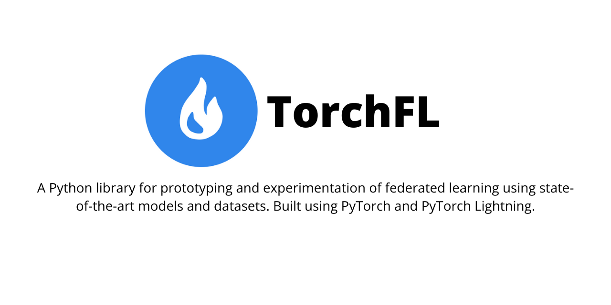

<div align="center">
	
</div>

## Table of Contents

- [Key Features](#features)
- [Available Models](#models)
- [Available Datasets](#datasets)
- [Installation](#installation)
- [Examples](#examples)
- [Contributing](#contributing)
- [Authors](#authors)
- [License](#license)

## Features

- Python 3.6+ support. Built using ```torch-1.10.1```, ```torchvision-0.11.2```, and ```pytorch-lightning-1.5.7```.
- Customizable implementations for state-of-the-art deep learning models which can be trained in federated or non-federated settings.
- Supports finetuning of the pre-trained deep learning models, allowing for faster training using transfer learning.
- Datamodules stuff. FIXME.
- Bottom-up approach to add custom models and datasets on the go. FIXME
- Federated learning support. FIXME.
- Loggers support and checkpointing using Lightning Modules. FIXME.
- For more documentation related to the usage, visit - https://torchfl.readthedocs.io/. 


## Available Models
For the initial release, ```torchfl``` will only support state-of-the-art computer vision models. The following table summarizes the available models, support for pre-training, and the possibility of using the finetuned implementations.

FIXME - add a table here.


## Available Datasets
Following datasets have been wrapped inside a ```LightningDataModule``` and made available for the initial release of ```torchfl```. To add a new dataset, check the source code in ```torchfl.datamodules```, add tests, and create a PR with ```Features``` tag.

FIXME - add a table here.
